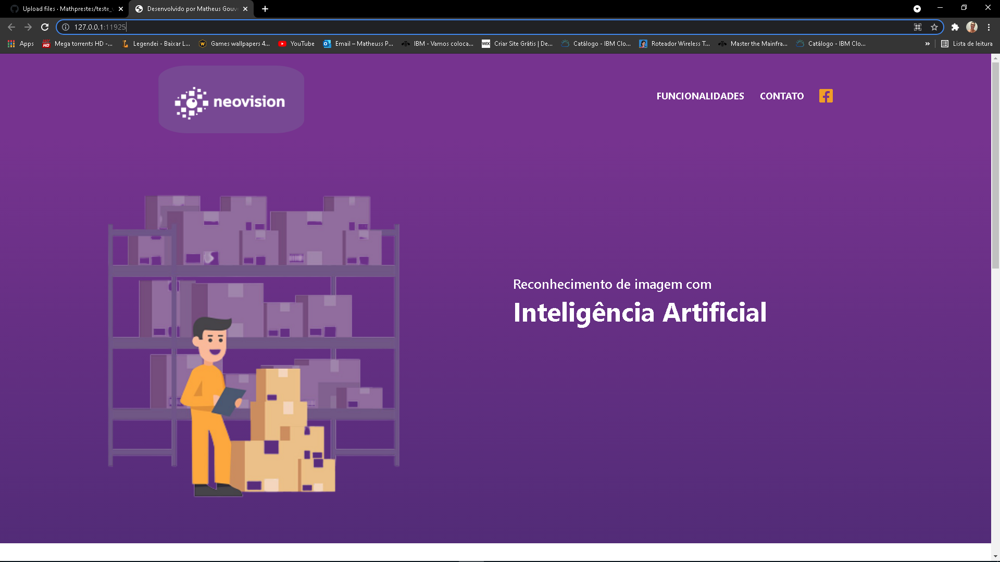
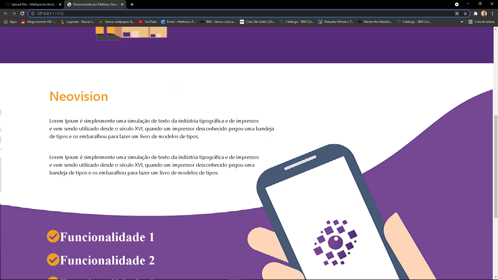
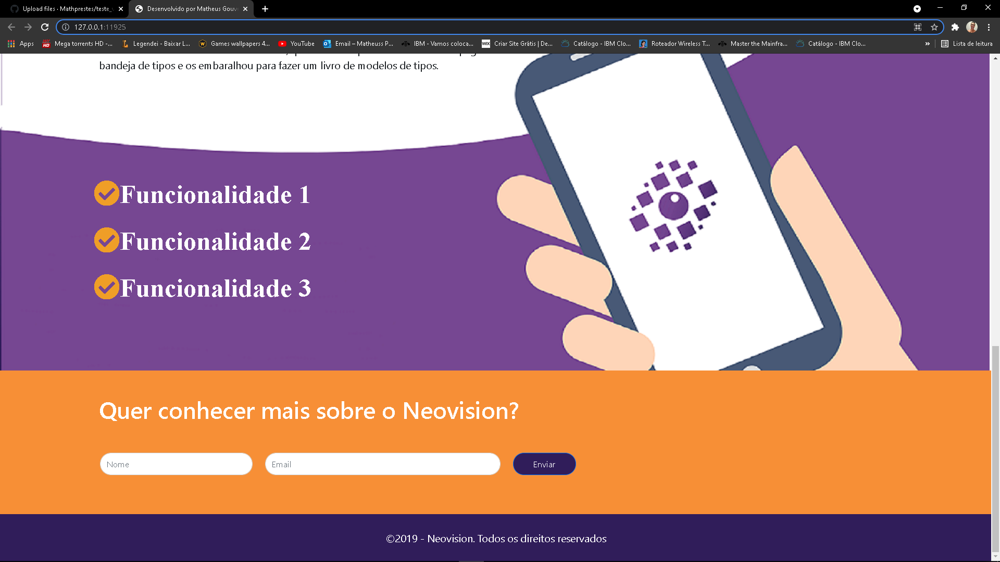
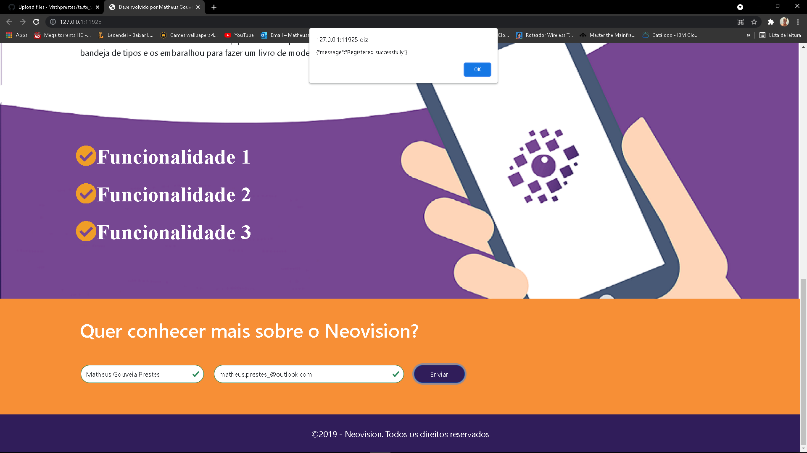

# teste_vaga_T2
Teste para a vaga de Estagio - Desenvolvedor Front-end

Teste finalizado, usando HTML, CSS, Bootstrap e JavaScript

# Deploy no Netlify
### https://teste-vaga-t2.netlify.app

## :eye_speech_bubble: **PROJETO FINAL*

### :desktop_computer: Computador

|Desktop|Desktop|
|:---:|:---:|
|<kbd></kbd>|<kbd></kbd>

|Desktop|Desktop|
|:---:|:---:|
|<kbd></kbd>|<kbd></kbd>

-----------------------------------

